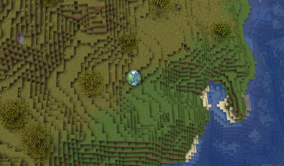

# BlueMapSpawn

Adds a marker with the spawn location of your worlds on your [BlueMap](https://github.com/BlueMap-Minecraft/BlueMap) maps.

## Compatibility

This plugin should be compatible with Spigot/Paper (and derivatives) starting with version 1.13.

## Configuration

The plugin provides a few configuration options to customize the marker, or the web assets.
All configuration values are in the standard `plugin.yml`.
The plugin is reloaded normally when BlueMap is reloaded.

## Download

The plugin `.jar` can be downloaded via the [Releases](https://github.com/Renaud11232/BlueMapSpawn/releases) page.

## Need help ?

If you need help / encounter an bug, please [open an issue](https://github.com/Renaud11232/BlueMapSpawn/issues/new).