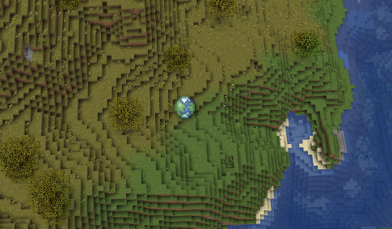

# BlueMapSpawn

Adds a marker with the spawn location of your worlds on your [BlueMap](https://github.com/BlueMap-Minecraft/BlueMap) maps.

## Compatibility

Please refer to the following table to find the best version for your server :

| BlueMapSpawn version | Bukkit (Paper, Spigot, etc.) version | Fabric version |
|----------------------|--------------------------------------|----------------|
| 1.0.0                | 1.20 and up                          | Not supported  |
| 1.1.0                | 1.13 and up                          | Not supported  |
| 2.0.0                | 1.13 and up                          | 26.1 - 26.2    |

## Configuration

The plugin provides a few configuration options to customize the marker.
All configuration values are in the standard `config.yml` (for Bukkit based servers) and `config.json` for Fabric servers.
The plugin is reloaded normally when BlueMap is reloaded.

## Download

The plugin `.jar` can be downloaded via the [Releases](https://github.com/Renaud11232/BlueMapSpawn/releases) page.

## Need help ?

If you need help / encounter an bug, please [open an issue](https://github.com/Renaud11232/BlueMapSpawn/issues/new).